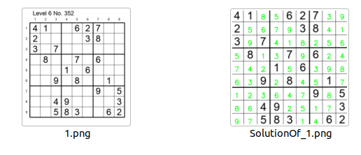

**To solve a Sudoku board**
```python 
python3 solve.py --model models / sudoku_weights.h5 --image data / tests / 1.png --one
```
**To solve all Sudoku tables in the tests folder**
```python
python3 solve.py --model models / sudoku_weights.h5 --folder data / tests --many
```
**To train the training model**
```python
python3 train.py --train
```
**To generate data numbers 1-9 from sudoku board**
Step 1: Collect 9x9 tabular data
Crawl tables sudoku 9x9 from google, run the command
```python
python crawl.py
```
From the books on the sudoku algorithm (key data for train) (https://book4you.org/s/sudoku%20puzzle)

Step 2: Automatically generate data with digits 1 to 9
python make_raw_data.py --model models / sudoku_weights.h5

Step 3: Refine the data manually (of course, due to training error)
